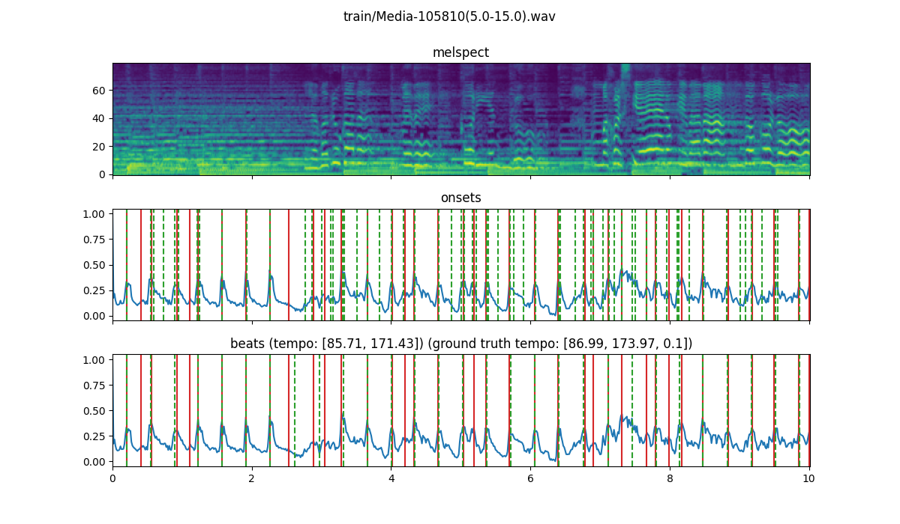
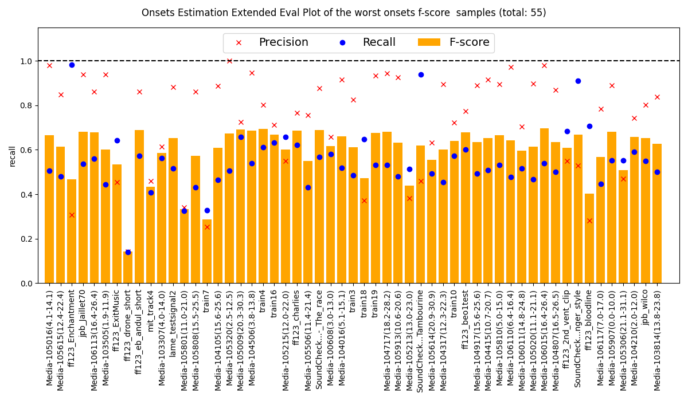
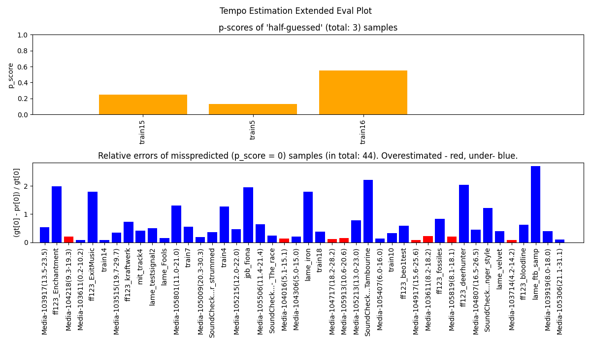
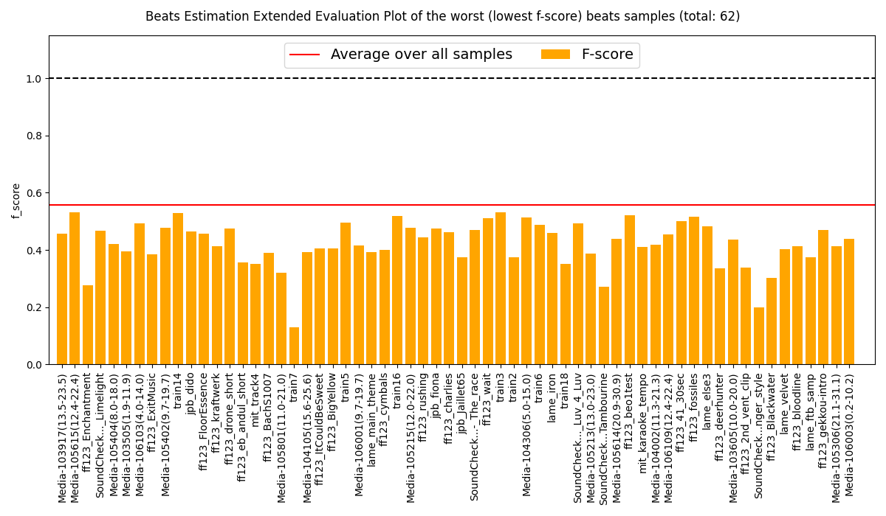

Audio and Music Processing Challenge Repo
=============================================
Environment set up
-------------
```
$ pip install -r requirements.txt
```

`detector.py`
-------------

Needs two arguments: a directory of `.wav` files to process and the file name of a `.json` file to write the predictions to. 

Options:

`--plot_lvl` takes an integer value
if > 0, then visualizes computed features and predictions for each file as they are processed.
if > 1, produces extra plots of odf and its peaks (aka onsets) selection process.

`--method` takes str value
Possible methods are 'central_avg_envelope' and 'spectral_diff'(default value), 'melspect_diff', 'melsepect_cnn'.

For details on other options run `./detector.py --help`.

`evaluate.py`
-------------

Takes two arguments: path to the ground truth and to the predictions. Each can be a directory of `.onsets.gt`, `.tempo.gt` and `.beats.gt` files or a `.json` file.

Suggested use
-------------
```
$ ./detector.py train/ output.json 
File: 100%|█████████████████████████████████████████████████████| 127/127
$ ./evaluate.py train/ output.json
Onsets F-score:  0.7149
--------------------
Tempo p-score:  0.6003
--------------------
Beats F-score:  0.5570
--------------------
```

When training files are used and groundtruth is available in the same dir (`.gt` files with same names as `.wav` files):
1. `detector.py` with `--training` on top of `--plot_lvl 1` gives for more detailed plot for each file (cross the plot window to proceed with next sample or quit python plotting to stop further training), for example:
```
$ ./detector.py ./train/ output.json --training --plot_lvl 1
```
<p align='center'>
  
</p>
For onsets and beats dashed green lines are true values and solid red lines are predictions. 

2. `evaluation.py` prodives extra visuals and evaluation measures with `--extended`, namely one more plot for each (onsets, tempo and beat) estimation, for example:
```
./evaluate.py ./train/ output.json --extended
```
<p align='center'>
  
</p>

After closing this, you'll see:
<p align='center'>
  
</p>

After closing 2nd plot:
<p align='center'>
  
</p>

After the plot again, you'll arrive at:

```
Onsets F-score:  0.7149
--------------------
Tempo p-score:  0.6003
--------------------
Beats F-score:  0.5570
--------------------
```

And on top of that in case ground truth was provided for all 3 features (beats, onsets and tempo), one should see the following:

```
Samples on which all 3 estimations were poor (total: 14):
ff123_Enchantment
ff123_beo1test
mit_track4
Media-105215(12.0-22.0)
SoundCheck2_64_Instrumental_Acoustic_steel_strung_guitar_finger_style
Media-105213(13.0-23.0)
train7
SoundCheck2_73_Instrumental_Tambourine
ff123_bloodline
Media-105306(21.1-31.1)
SoundCheck2_82_Yello_-_The_race
train16
train18
ff123_ExitMusic
Media-105801(11.0-21.0)
--------------------
```